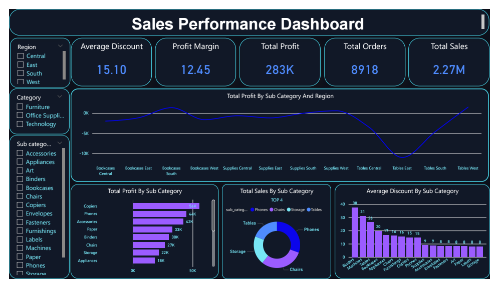

# Sales Performance Analysis

## Project Overview
End-to-end data analysis project for a retail company using the 
Superstore dataset (9,694 records).

The project simulates a real business scenario where management 
needs answers to critical sales and profitability questions.

**Business Context:**
A retail company is experiencing profit concerns and needs a 
Data Analyst to investigate performance across products, 
categories, and regions.

---

## Business Questions Answered

| # | Business Question | Method |
|---|---|---|
| 1 | What are total sales, profit, and orders? | Aggregation |
| 2 | Which categories are losing money? | GROUP BY + CASE WHEN |
| 3 | Which products have the highest losses? | HAVING + ORDER BY |
| 4 | Where geographically are losses occurring? | Multi-column GROUP BY |
| 5 | Is discount the root cause of losses? | Profit Margin vs Discount Analysis |

---

## Data Cleaning Process

### Problem 1: Column Names with Spaces
Imported CSV had column names like `Product Name`, `Order ID`.
MySQL requires backticks for names with spaces — renamed all 
columns using:
```sql
ALTER TABLE superstore_sales 
RENAME COLUMN `Product Name` TO product_name;
```

### Problem 2: Incorrect Data Types
Dates stored as TEXT — converted to DATE type for time-based 
analysis.

### Problem 3: Missing Records
Dataset had 300 fewer rows than expected after import — 
investigated using NULL checks and data validation queries.

---

## SQL Analysis — Step by Step

### Step 1: Data Validation
```sql
SELECT COUNT(*) FROM superstore_sales;
SELECT MIN(order_date), MAX(order_date) FROM superstore_sales;
```

### Step 2: Overall Business Performance
```sql
SELECT 
    SUM(sales) AS total_sales,
    SUM(profit) AS total_profit,
    COUNT(DISTINCT order_id) AS total_orders,
    ROUND(SUM(profit)/SUM(sales)*100, 2) AS profit_margin
FROM superstore_sales;
```

### Step 3: Identifying Loss-Making Sub-Categories
```sql
SELECT 
    sub_category,
    ROUND(SUM(profit), 2) AS total_profit,
    CASE 
        WHEN SUM(profit) > 0 THEN 'WIN'
        WHEN SUM(profit) <= 0 THEN 'LOSE'
    END AS profit_status
FROM superstore_sales
GROUP BY sub_category
HAVING SUM(profit) <= 0
ORDER BY total_profit ASC;
```

### Step 4: Geographic Loss Analysis
```sql
SELECT 
    region,
    sub_category,
    ROUND(SUM(profit), 2) AS total_profit
FROM superstore_sales
GROUP BY region, sub_category
HAVING SUM(profit) <= 0
ORDER BY total_profit ASC;
```

### Step 5: Root Cause — Discount vs Profit Margin
```sql
SELECT 
    sub_category,
    ROUND(SUM(profit)/SUM(sales)*100, 2) AS profit_margin,
    ROUND(AVG(discount), 2) AS avg_discount
FROM superstore_sales
GROUP BY sub_category
ORDER BY profit_margin;
```

---

## Key Findings

| Metric | Value |
|---|---|
| Total Sales | $2.27M |
| Total Profit | $283K |
| Profit Margin | 12.45% |
| Total Orders | 8,918 |
| Avg Discount | 15.10% |

### Loss-Making Sub-Categories

| Sub-Category | Profit Margin | Avg Discount |
|---|---|---|
| Tables | -8.56% | 26% |
| Bookcases | -3.02% | 21% |
| Supplies | -2.93% | 8% |

---

## Root Cause Discovery

**Initial hypothesis:** High discounts cause losses.

**Finding that challenged the hypothesis:** 
Binders have the highest discount (37%) yet achieve 15% 
profit margin — higher than many low-discount products.

**Revised conclusion:** 
The issue is not discounting alone — Tables have a structural 
pricing problem. Their cost structure makes them unprofitable 
even before any discount is applied.

---

## Recommendations

1. **Immediate:** Review Tables cost structure and pricing model
2. **Short-term:** Stop blanket discounting on low-margin products
3. **Strategic:** Build a discount policy based on each 
   product's profit margin threshold — never discount below 
   break-even point

---

## Tools Used

| Tool | Purpose |
|---|---|
| MySQL | Data cleaning, transformation, analysis |
| Power BI | Interactive dashboard & visualization |
| GitHub | Version control & portfolio |

---

## Dashboard Preview


